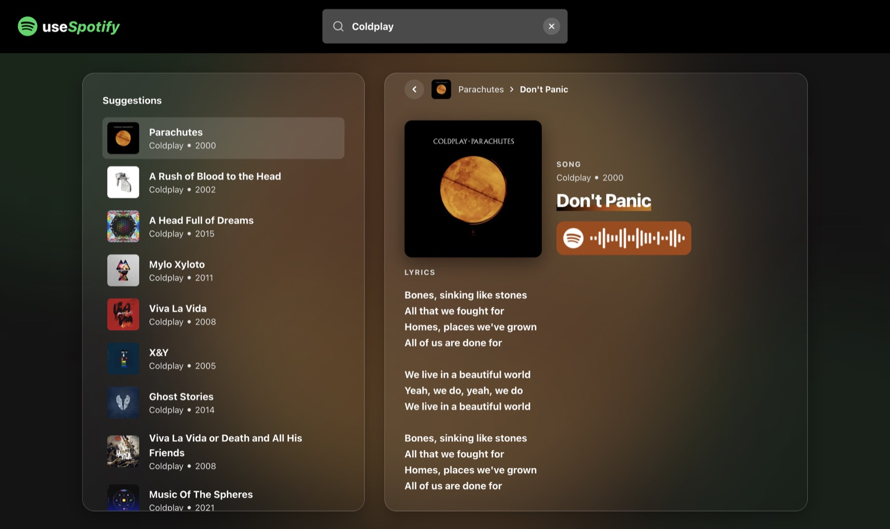

# useSpotify

Search Spotify albums, browse tracklists and read lyrics.


Built with Next.js (App Router), TypeScript and Tailwind CSS. Lyrics come from [LRCLIB](https://lrclib.net).



## Setup

Create a Spotify app in the [developer dashboard](https://developer.spotify.com/dashboard), then add its credentials to `.env.local`:

```env
SPOTIFY_CLIENT_ID=...
SPOTIFY_CLIENT_SECRET=...
```

Install and run:

```bash
pnpm install
pnpm dev
```

The app runs at http://localhost:3000.

## Scripts

| Script | Description |
|---|---|
| `pnpm dev` | Dev server |
| `pnpm build` | Production build |
| `pnpm start` | Serve production build |
| `pnpm lint` | ESLint |
| `pnpm typecheck` | TypeScript check |

## API

Spotify credentials stay server-side. The client calls:

- `GET /api/search?q=<query>`: matching albums, paginated
- `GET /api/albums/<id>`: album with tracks

## Layout

```
app/          routes, layout, API route handlers
components/   UI components
hooks/        data fetching and UI hooks
lib/          Spotify client, lyrics, formatting helpers
types/        shared types
```
